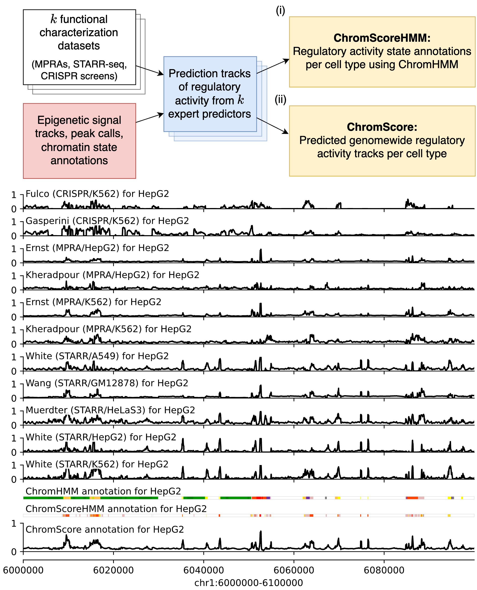

# ChromActivity 

ChromActivity is a computational framework for the annotation of regulatory activity genomewide, through integration of data from epigenomic maps and multiple functional characterization assays. 

We generate three types of annotations:

- **Expert score tracks:** Genomewide regulatory activity prediction tracks associated with each functional characterization assay dataset across all cell and tissue types with epigenome data
- **ChromScoreHMM annotations:** Cell type specific genome annotations based on the combinatorial and spatial patterns within the expert predictions
- **ChromScore tracks:** Genomewide, cell type specific ensemble regulatory activity prediction tracks. Provides a numerical score for each 25 bp interval in the genome



## Precomputed annotations
Precomputed annotations are available to download at: https://ucla.box.com/v/chromactivity

View annotations on the UCSC Genome Browser: [session link](https://genome.ucsc.edu/cgi-bin/hgTracks?hgS_doLoadUrl=submit&hgS_loadUrlName=https://public.hoffman2.idre.ucla.edu/ernst/WFZ6G/hubs/chromactivity_hub/chromactivity_session.txt), [track hub link](https://public.hoffman2.idre.ucla.edu/ernst/WFZ6G/hubs/chromactivity_hub/chromactivity_hub.hub.txt)

## Getting started
ChromActivity manages its dependencies using the `conda` package manager. [Mambaforge](https://github.com/conda-forge/miniforge#mambaforge) is the recommended distribution for installing `conda`. 


```sh
# Download ChromActivity from repository
git clone --depth 1 https://github.com/ernstlab/chromactivity

# Set up conda environment
cd chromactivity
conda env create -f environment.yml
conda activate chromactivity_env

# Download and extract ChromHMM
wget -N -P vendored https://ernstlab.biolchem.ucla.edu/ChromHMM/ChromHMM.zip
unzip -o vendored/ChromHMM.zip -d vendored
```

## Raw data directories

By default, ChromActivity uses imputed epigenomic data from the [Roadmap Epigenomics](https://egg2.wustl.edu/roadmap/web_portal/index.html) compendium with the following directory structure:

```py
# Data URLs: https://egg2.wustl.edu/roadmap/web_portal/imputed.html

# Imputed signal tracks
f"data/raw/roadmap/signal/{cell_type}/{cell_type}-{mark}.imputed.pval.signal.bigwig"

# Peak calls
f"data/raw/roadmap/peaks/{cell_type}/{cell_type}-{mark}.imputed.narrowPeak.bed.nPk.gz"

# 25-State ChromHMM model
f"data/raw/roadmap/chromstate/chromstate_25/{cell_type}/{cell_type}_25_imputed12marks_mnemonics.sorted.bed",
```

Overriding the default directory structure is possible by modifying `chromactivity/mappings.py`.

## Usage examples

Command line usage examples:
```sh
# Train and serialize ChromActivity experts using the default labels in "data/labels"
chromactivity train_experts --labels_dir data/labels --model_out_fn "models/my_chromactivity.model"

# Generate tracks from serialized model for the HepG2 (Roadmap epigenome ID: E118) cell type
chromactivity generate_tracks --model_fn "models/chromactivity.model" --cell_types "E118" --coords_bed_fn "data/external/test.bed" --combined_bigwigs_out_dir "tracks/"

# Generate ChromScoreHMM annotations from generated tracks
chromactivity train_chromscorehmm --num_states 15 --track_dir "tracks/" --out-dir "models/chromscorehmm"
```


## External resources

- `vendored/ChromHMM/ChromHMM.jar`: https://ernstlab.biolchem.ucla.edu/ChromHMM
- `data/external/hg19.chrom.sizes`: https://hgdownload.soe.ucsc.edu/goldenPath/hg19/bigZips/hg19.chrom.sizes
